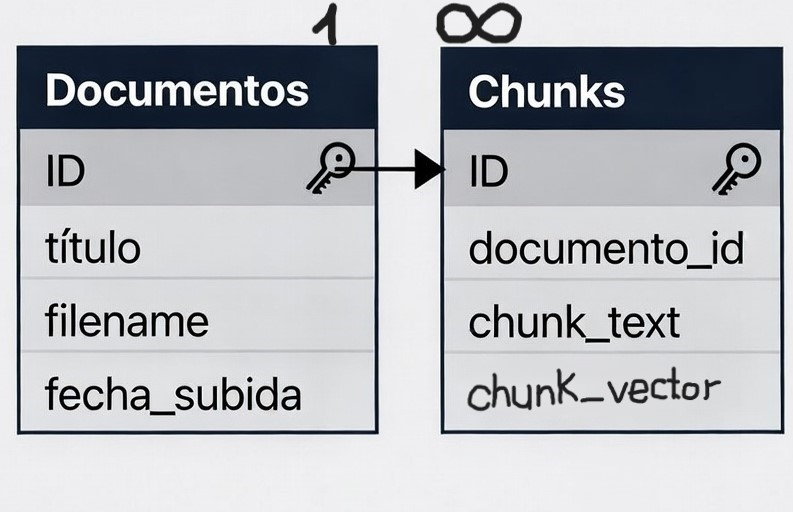

# PIA-Pio_Baroja_IA - TFG DAW – Asistente docente con IA local
PIA es un asistente de inteligencia artificial basado en Ollama, una plataforma de modelos de IA de código abierto y uso gratuito. En nuestro sistema hemos incorporado un flujo automatizado de lectura y almacenamiento de documentos PDF en nuestra base de datps, lo que permite indexar su contenido y consultarlo posteriormente mediante lenguaje natural.

Gracias a este proceso, el usuario puede realizar preguntas directamente sobre sus documentos sin necesidad de revisar manualmente cada archivo. Esto reduce el tiempo de búsqueda, mejora la eficiencia en la gestión de la información y facilita la obtención de resúmenes rápidos y precisos del contenido requerido.

## 1. Guía de instalación de Prerrequisitos 
Para comenzar necesitaremos tener GIT instalado en nuestro sistema.
¿Qué es GIT?
Git es un sistema de control de versiones que te permitirá descargar (clonar) este repositorio en tu máquina.

### Opcion A) Windows

- Descarga: Ve a la página oficial de [Git for Windows](https://git-scm.com/install/windows) y descarga el instalador según las características de su equipo.

- Instalación: Ejecuta el instalador y sigue los pasos. La configuración por defecto es suficiente para la mayoría de los usuarios.

### Opcion B) macOS

Es muy probable que ya tengas Git instalado. Puedes verificarlo abriendo la Terminal (Win+R y escriba "cmd") y escribiendo `git --version` . Si no lo está, la forma más sencilla de instalarlo es a través de Homebrew.

- **Instalar Homebrew** (si no lo tienes): Abre la Terminal y ejecuta el siguiente comando:
```
/bin/bash -c "$(curl -fsSL https://raw.githubusercontent.com/Homebrew/install/HEAD/install.sh)"
```
- **Instalar Git**: Una vez instalado Homebrew, ejecuta:
```
brew install git
```
### Opcion C) Ubuntu/ Derivados de Debian

La mayoría de las distribuciones de Linux vienen con Git. Si no es tu caso, puedes instalarlo fácilmente.

- Instalación: Abre una terminal y ejecuta los siguientes comandos para actualizar la lista de paquetes e instalar Git: 
``` 
sudo apt update 
sudo apt install git 
```
## 2. Configuración del proyecto
Una vez instaladas todas las herramientas necesarias, procedemos a descargar el proyecto:

### A) Clonar repositorio desde GitHub
Abre una terminal (Git Bash en Windows, Terminal en macOS/Linux) y ejecuta el siguiente comando para descargar el código:
```
git clone <URL_DEL_REPOSITORIO>
``` 
*Nota: Reemplaza <URL_DEL_REPOSITORIO> con la URL real de este repositorio. ej: https://github.com/hugovt3/PIA-Pio_Baroja_IA*

Luego, navega a la carpeta que se acaba de crear usando el comando "cd" en windows:
```
cd carpeta_PIa-Pio_Baroja_IA
```
### B) Descargar bibliotecas necesarias
Una vez estemos dentro de nuestra carpeta, necesitaremos realizar algunas descargas adcionales que hemos facilitado en un archivo requirements para la comodidad del usuario, para usarle seguiremos los siguientes pasos:

Si usamos el comando `dir` podremos ver todas las subcarpetas del proyecto, nos interesa la de backend, por lo que introducimos el siguiente comando
```
cd backend
```
Una vez dentro utilizaremos el comando: 
```
pip install -r requirements.txt
```
Cuando finalice, habremos descargado todas las bibliotecas de python necesarias.

### C) Iniciar la app (NEW)
Ejecutar run_app.bat (puede tardar un poco al cargar la app en el navegador, esperar a que se recargue sola)

### C) Iniciar la app (OLD)

Para iniciar la app, volveremos a la carpeta de backend, y ejecutamos el programa que inicia la página web en local con el siguiente comando:
```
python app.py
```
Igual tarda un tiempo, cuando cargue nos aparecerá la siguiente información de que la app se ha iniciado correctamente
```
FAISS cargado con 2 vectores
 * Serving Flask app 'app'
 * Debug mode: on
WARNING: This is a development server. Do not use it in a production deployment. Use a production WSGI server instead.
 * Running on http://127.0.0.1:5000
Press CTRL+C to quit
 * Restarting with stat
FAISS cargado con 2 vectores
 * Debugger is active!
 * Debugger PIN: 468-979-702

```
Usaremos el link que nos proporciona el mensaje para abrir el puerto en cualquier navegador

*Nota: recomendamos google para iniciar esta app*

Y deberiamos ver nuestra aplicación funcionando correctamente

## 3. Especificaciones/Datos Extras del proyecto
### Módelo Base de datos


Modelo Mínimo en 2FN

### Datos de PDF`S
Los PDF`S subidos a la app los podrás encontrar en la carpeta docs, se ira actualizando según vayas subiendo documentos, si por error borra alguno, no se preocupe, **SOLO LA INFORMACIÓN** seguirá guardada en la BBDD
### Tecnologías utilizadas
Python: BACK-END

SQLite: DataBase

HTML-CCS-JS: FRONT-END


